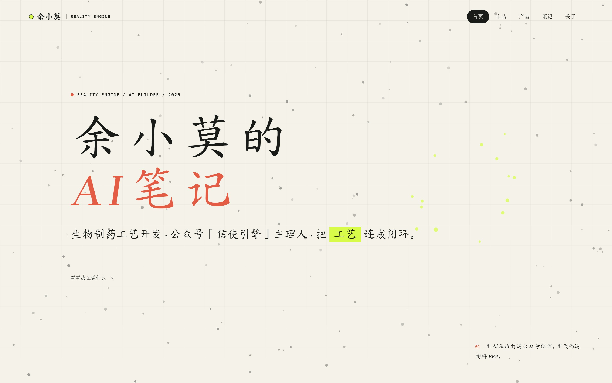

# 余小莫的 AI 笔记

<p align="center">
  
  
  
  
</p>

<p align="center">
  
</p>

## 🌐 在线访问

👉 **主站点：** https://rcrusoe88-bot.github.io/yuxiaomo-ai-notes/

🔗 **备用站点（腾讯云 CloudBase）：** https://wushengjun19931208-d6cakfbffbca8-1342178972.tcloudbaseapp.com/

## 内容发布

1. 在 `content/codex`、`content/claude`、`content/reasonix` 或 `content/workbuddy` 新建 `.mdx` 文件。
2. 填写 `title`、`summary`、`date` 三项 front matter。
3. 图片放入 `public/articles/<slug>/`，在 MDX 中用 `/articles/<slug>/image.png` 引用。
4. 运行 `npm run build`，静态站点输出到 `out/`。

公开端没有上传、编辑或下载入口。作者只在本地维护 MDX 内容，部署时上传 `out/`。

## 🧱 技术栈

| 层 | 选型 |
|---|---|
| 框架 | Next.js（App Router，静态导出 `output: 'export'`） |
| 内容 | MDX（front matter：`title` / `summary` / `date`） |
| 样式 | CSS |
| 部署 | GitHub Pages（主站） + 腾讯云 CloudBase（备用） |

## 🗂️ 目录结构

```
app/                  # Next.js App Router 页面
components/           # 复用组件
content/
  ├─ codex/           # Codex 相关笔记（.mdx）
  ├─ claude/          # Claude 相关笔记
  ├─ reasonix/        # Reasonix 相关笔记
  └─ workbuddy/       # WorkBuddy 相关笔记
lib/                  # 内容读取与工具函数
public/articles/      # 文章配图，按 slug 分目录
next.config.mjs       # 静态导出配置
```

## 🛠️ 本地开发

```bash
npm install       # 安装依赖
npm run dev       # 本地开发预览
npm run build     # 构建静态站点，产物输出到 out/
```

部署说明详见 [DEPLOYMENT.md](./DEPLOYMENT.md)。

---

## 📊 作者 GitHub 数据

<p align="center">
  
  
</p>
